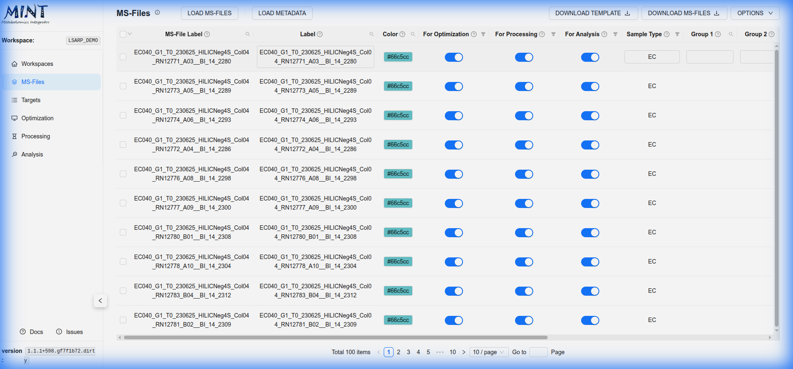
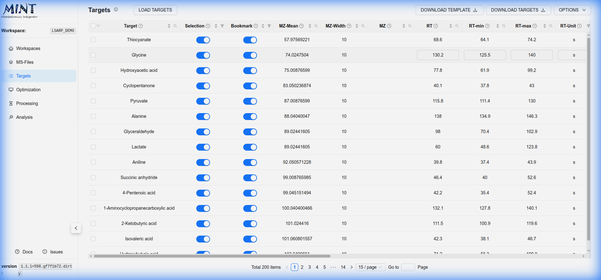
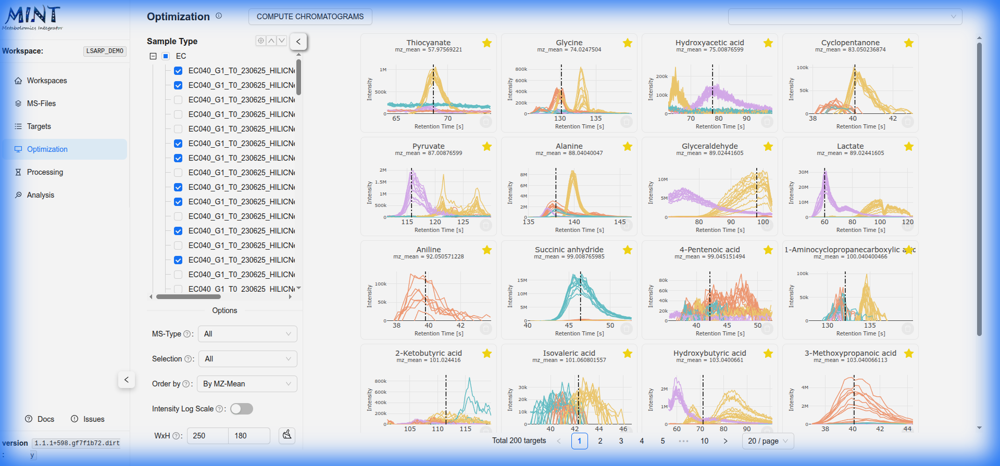

# MINT GUI 

The MINT Graphical User Interface (GUI) serves as the central hub for your metabolomics workflow. It guides you through every step of the process; from organizing your files in workspaces to optimizing peak integration and analyzing the final results. This section details each component of the interface and how to use it effectively. 

## Workspaces

Workspaces allow you to organize and separate different projects. Each workspace is a self-contained environment for your project files.

> **Tip**: Click the help icon (small "i" symbol) next to the "Workspaces" title to take a guided tour of this section.

### Storage Location
All files for a workspace are stored in a subdirectory within your MINT data folder (`--data-dir`).

- **Default Location**: `~/MINT` (Linux/macOS) or `C:/Users/<username>/MINT` (Windows)
- **Active Workspace**: The active workspace is displayed in the sidebar under "Workspace:".

### Managing Workspaces

You can manage your workspaces using the controls in the Workspaces tab:

-   **Create a Workspace**: Click the **Create Workspace** button (bottom left). Enter a name in the popup window and click **Create**.
-   **Activate a Workspace**: Click on the selection circle in the list. The active workspace is indicated by a text notification and update in the sidebar.
-   **Delete a Workspace**: Select a workspace and click the **Delete Workspace** button (bottom right). Confirm the action in the popup window.
    
    > **Warning**: Deleting a workspace will permanently remove the workspace folder and all its contents from your hard drive. This action cannot be undone.

### Workspace Details
Click the **+** icon next to a workspace name to expand the row. This shows the absolute path to the workspace and a summary of the data it contains (_e.g._, number of MS-files, targets, and results). 

## MS-Files

The **MS-Files** tab is the entry point for your analysis. Here you organize the raw mass spectrometry data that constitutes your workspace. MINT currently supports **.mzXML** and **.mzML** file formats.

> **Tip**: Click the help icon (small "i" symbol) next to the "MS-Files" title to take a guided tour of this section.

### Loading Files
To add data to your workspace, click the **Load MS-Files** button. This opens a dedicated file browser modal where you can:

1.  **Browse Server Files**: Use the left pane to navigate the directory structure of the computer running MINT.
2.  **Select Files**: Check the boxes next to the files you wish to import. You can filter by file extension (e.g., `.mzXML`, `.mzML`) using the tags below the file list.
3.  **Review Selection**: The right pane shows your currently selected files. You can remove specific files or clear the entire selection before processing.
4.  **Process**: Click **Process Files** to import them into your workspace. MINT will automatically extract the information to a DuckDB database.
    *   **CPUs**: You can specify the number of CPU cores to use for parallel processing to speed up the import of large datasets.

### The Main Table
The main table displays an overview of all imported files with several interactive columns:

*   **Checkbox**: Select multiple files for batch actions (like deletion).
*   **Color**: Click the colored dot to assign a specific color to a file or group of files. This color will be used in plots to identify these samples.
*   **For Optimization / Processing / Analysis**: Toggle switches to include or exclude specific files from different stages of the workflow.
*   **Metadata Columns**: Columns like  `Label`, `Sample Type`, and `Groups` allow you to organize your data. These are typically populated by importing a metadata file using the **Load Metadata** button.

**Options Menu**: The **Options** dropdown (top right) provides quick actions such as:

*   **Delete selected files**: Removes currently checked files from the workspace.
*   **Reset filters/columns**: Restores the default table view.

## Targets

Target lists are collections of peak definitions used to extract MS intensities for specific metabolites. You can manage them in the **Targets** tab.

> **Tip**: Click the help icon (small "i" symbol) next to the "Targets" title to take a guided tour of this section.

### Managing Targets

-   **Load Targets**: Import your target list from a CSV file.
-   **Template**: Download a CSV template with the required columns and examples.
-   **Review and Edit**: Inspect the loaded targets, filter/sort columns, and use multi-select to perform bulk actions (like deleting specific rows).
-   **Export**: Download the currently filtered target table for review or sharing.
-   **Clear**: Remove all targets to start fresh.

Target lists can be provided as Excel or CSV files. For more details on the file format, see [Target Lists](targets.md).

## Optimization

The **Optimization** tab is designed to refine your peak integration windows (Retention Time) for specific targets. By optimizing the Retention Time (RT) ranges, you ensure that MINT extracts the maximum intensity for the correct peak, improving data quality.

> **Tip**: Click the help icon (small "i" symbol) next to the "Optimization" title to take a guided tour of this section.

### Peak Optimization Workflow

1.  **Define Scope**: Use the sidebar to select the specific **Samples** (by type, batch, etc.) and **Targets** you want to optimize.
2.  **Compute Chromatograms**: Click the **COMPUTE CHROMATOGRAMS** button. MINT will extract and display the Ion Chromatograms (EIC) for the selected targets across your samples.
3.  **Review Optimization Cards**: The results are displayed as "Optimization Cards". Each card represents a target and shows:
    *   **Chromatogram Plot**: The shape of the peak across samples.
    *   **Current RT Range**: The vertical dashed lines indicate the start and end of the integration window.

### Interactive Manual Optimization
Click on any **Optimization Card** or the **Graph** icon to open the detailed **Manual Optimization** modal. In this view, you can fine-tune the peak selection:

*   **Interactive Tuning**: Click and drag on the plot to manually set the new Retention Time (RT) start and end points for the target.
*   **Intensity Scale**: Toggle between **Linear** and **Logwise** scales to better visualize low-intensity peaks.
*   **Legend Behavior**: Switch between **Group** (aggregated) or **Single** (individual file) legend displays.
*   **Edit RT-span**: Enable **Edit** mode to adjust ranges, or **Lock** to prevent accidental changes.
*   **Save/Reset**: Save your adjusted RT bounds to the target list or reset them to the original attributes.

## Processing

The **Processing** tab is where the core data extraction takes place. MINT extracts the peak areas and other features for all defined targets across your loaded MS-files.

> **Tip**: Click the help icon (small "i" symbol) next to the "Processing" title to take a guided tour of this section.

### Running the Analysis

1.  **Run MINT**: Click the **RUN MINT** button at the top left. A progress bar will indicate the status of the extraction process.
2.  **Select Targets**: Use the **Targets** dropdown menu to filter which metabolites are displayed in the results table.
3.  **Review Results**: The main table displays the extraction results. Key columns include:
    *   **peak_area**: The total area under the peak (primary quantitative metric).
    *   **peak_max**: The maximum intensity value of the peak.
    *   **peak_rt_of_max**: The retention time at which the maximum intensity occurs.
    *   **peak_mean / peak_median**: Statistical properties of the peak intensity.

### Exporting Data

Click the **DOWNLOAD RESULTS** button to open the export options:

*   **All Results**: Download the complete results table in "tidy" (long) format, suitable for advanced analysis in Python or R. You can customize which columns to include.
*   **Dense Matrix**: Generate a pivot table (wide format) which is often easier to use with spreadsheet software or for PCA/Heatmaps.
    *   **Rows/Columns**: Typically, files are rows and targets are columns (or vice versa).
    *   **Values**: Select the metric to fill the cells (default is `peak_area_top3` or `peak_area`).
    *   **Transpose**: Check this box to swap rows and columns.

### Managing Results

Use the **Options** menu (top right) to:

*   **Delete selected results**: Remove specific rows from the current view.
*   **Clear results**: Delete all processed results to start over (useful if you need to rerun with different parameters).
