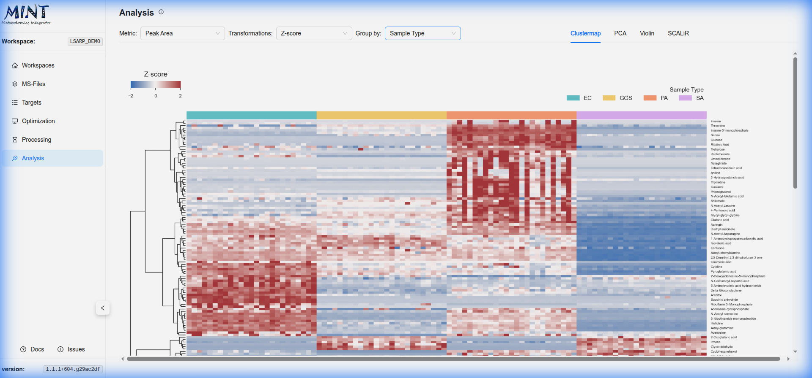
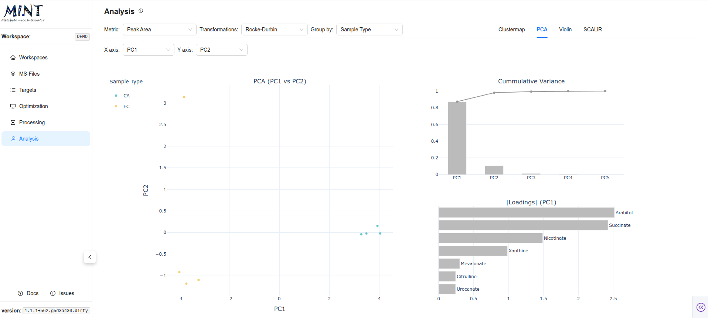
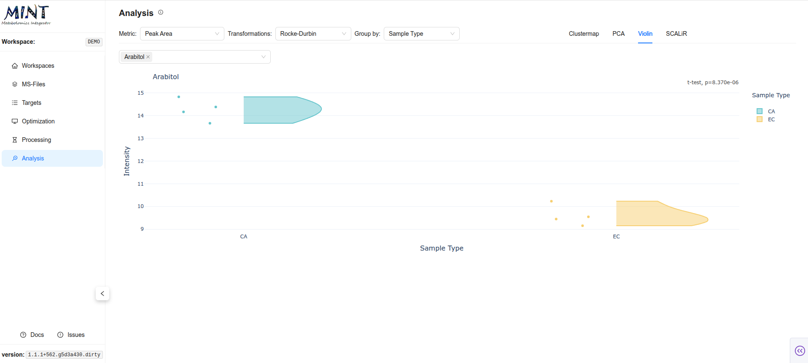
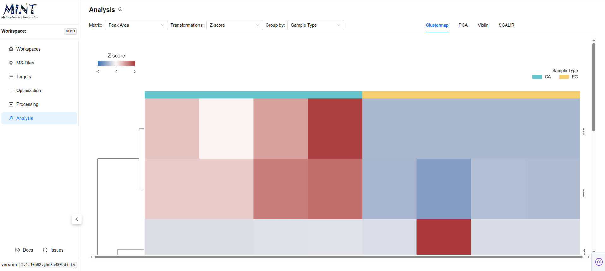

## Analysis {: #analysis }

The `Analysis` tab provides a suite of interactive visualizations for exploring your processed data. It allows you to switch between six main analytical views: `QC`, `PCA`, `t-SNE`, `Violin`, `Bar`, and `Clustermap`.

> **Tip**: Click the help icon (small "i" symbol) next to the "Analysis" title to take a guided tour of this section.

### Global Settings {: #global-settings }

The toolbar at the top of the Analysis tab controls the data input for all visualizations:

*   **Metric**: Select the quantitative value to analyze. Options include `Peak Area`, `Peak Area (Top 3)`, `Peak Max`, and (when available) `Concentration`.
*   **Transformations**: Apply statistical transformations to the raw data:
    *   **None (raw)**: Use raw values.
    *   **Z-score**: Standardize features (mean=0, std=1).
    *   **Rocke-Durbin**: Variance stabilization.
    *   **Z-score + Rocke-Durbin**: Standardize, then stabilize variance.
*   **Group by**: Choose a metadata column to group samples. This determines the coloring in QC, Clustermap, PCA, t-SNE, Violin, and Bar plots.
*   **Target (QC only)**: Select a peak to inspect QC plots and chromatograms.

### Analytical Views {: #analytical-views }

=== "QC"
    Quality-control view for a selected target.

    *   **RT Plot**: Retention-time stability across samples, grouped by your selected metadata column.
    *   **m/z Plot**: Observed m/z (if available) across samples.
    *   **Chromatogram**: Click a sample in either scatter plot to inspect the chromatogram for that target.

=== "PCA"
    **Principal Component Analysis**: Reduces the dimensionality of your data to visualize sample similarity.

    *   **Score Plot**: An interactive scatter plot of samples projected onto Principal Components (PCs).
    *   **Cumulative Variance**: Displays how much of the total dataset variance is explained by the first N components.
    *   **Loadings**: A bar chart showing which metabolites contribute most to each PC.

    

=== "t-SNE"
    **t-Distributed Stochastic Neighbor Embedding**: Nonlinear embedding to reveal local sample neighborhoods.

    *   **Axes**: Select the t-SNE dimensions to display (typically t-SNE-1 vs t-SNE-2).
    *   **Perplexity**: Adjust neighborhood size and regenerate to explore different structures.

=== "Violin (Distributions)"
    Focuses on the distribution of peak intensities for individual metabolites.

    *   **Selection**: Use the dropdown to search for and select a specific peak.
    *   **Stats**: Displays the distribution density and boxplots, grouped by your selected metadata column, along with ANOVA p-values for statistical significance.

    

=== "Bar"
    Aggregated summary view by group.

    *   **Mean ± SEM**: Bar chart with error bars.
    *   **Individual Samples**: Jittered points overlaid on bars.
    *   **Chromatogram**: Click a sample point to inspect its chromatogram.

=== "Clustermap (Heatmap)"
    Displays a hierarchical clustering of samples (columns) and metabolites (rows). It helps identify patterns and outliers in your dataset.

    
