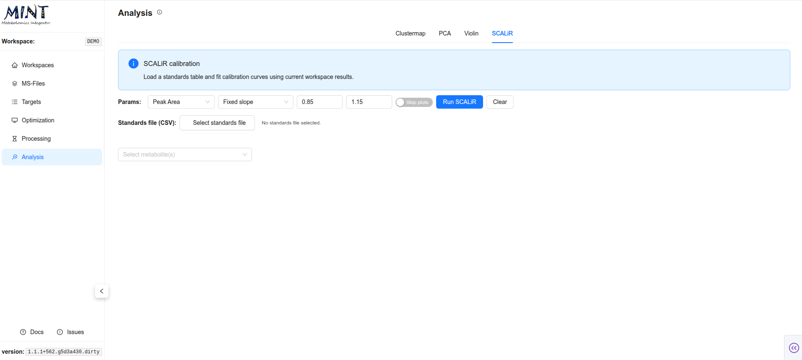

## Analysis {: #analysis }

The `Analysis` tab provides a suite of interactive visualizations for exploring your processed data. It allows you to switch between four main analytical views: `Clustermap`, `PCA`, `Violin`, and `SCALiR`.

> **Tip**: Click the help icon (small "i" symbol) next to the "Analysis" title to take a guided tour of this section.

### Global Settings {: #global-settings }

The toolbar at the top of the Analysis tab controls the data input for all visualizations:

*   **Metric**: Select the quantitative value to analyze. Options include `Peak Area`, `Peak Area (Top 3)`, `Peak Max`, etc.
*   **Transformations**: Apply statistical transformations to the raw data:
    *   **None**: Use raw values.
    *   **Z-score**: Standardize features (mean=0, std=1).
    *   **Rocke-Durbin**: Variance stabilization.
*   **Group by**: Choose a metadata column to group samples. This determines the coloring in Clustermap, PCA and Violin plots.

### Analytical Views {: #analytical-views }

=== "Clustermap (Heatmap)"
    Displays a hierarchical clustering of samples (columns) and metabolites (rows). It helps identify patterns and outliers in your dataset.

    

=== "PCA"
    **Principal Component Analysis**: Reduces the dimensionality of your data to visualize sample similarity.

    *   **Score Plot**: An interactive scatter plot of samples projected onto Principal Components (PCs).
    *   **Cumulative Variance**: Displays how much of the total dataset variance is explained by the first N components.
    *   **Loadings**: A bar chart showing which metabolites contribute most to each PC.

    

=== "Violin (Distributions)"
    Focuses on the distribution of peak intensities for individual metabolites.

    *   **Selection**: Use the dropdown to search for and select a specific peak.
    *   **Stats**: Displays the distribution density and boxplots, grouped by your selected metadata column, along with ANOVA p-values for statistical significance.

    

=== "SCALiR (Calibration)"
    A tool for absolute quantification using internal standards.

    *   **Upload Standards**: Load a CSV defining the concentration of standards.
    *   **Fit Calibration**: MINT fits calibration curves and calculates concentrations for your biological samples.

    
