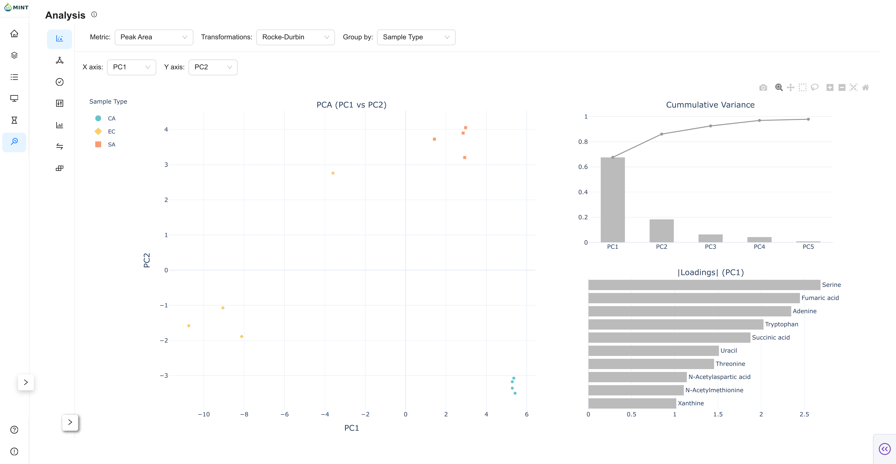
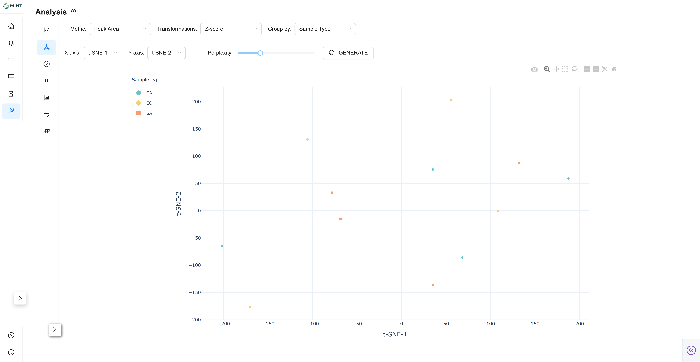
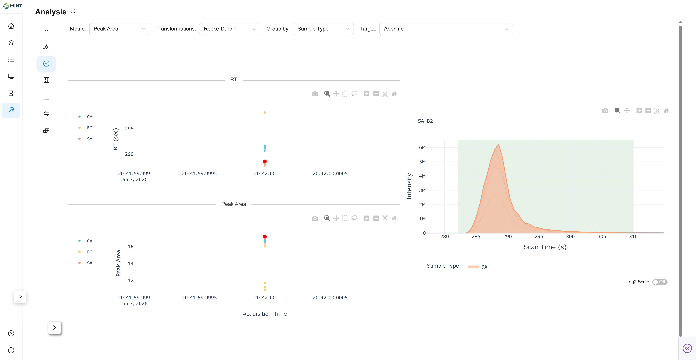
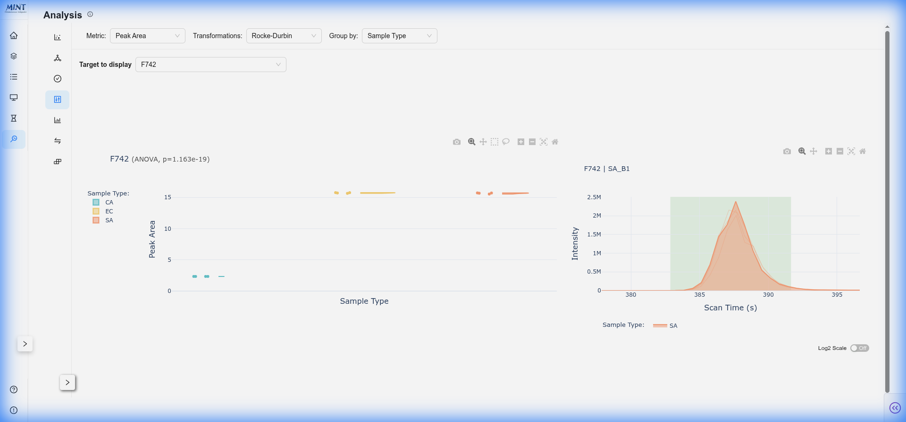
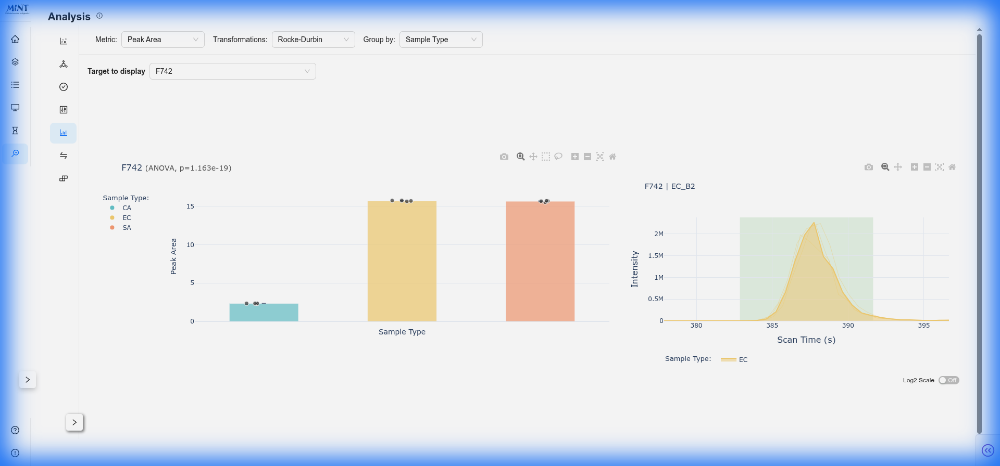
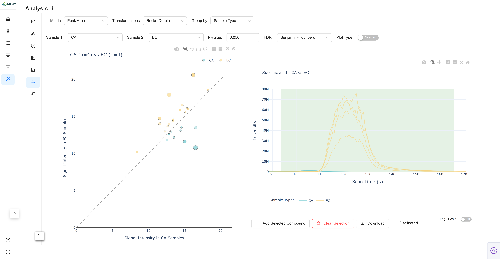
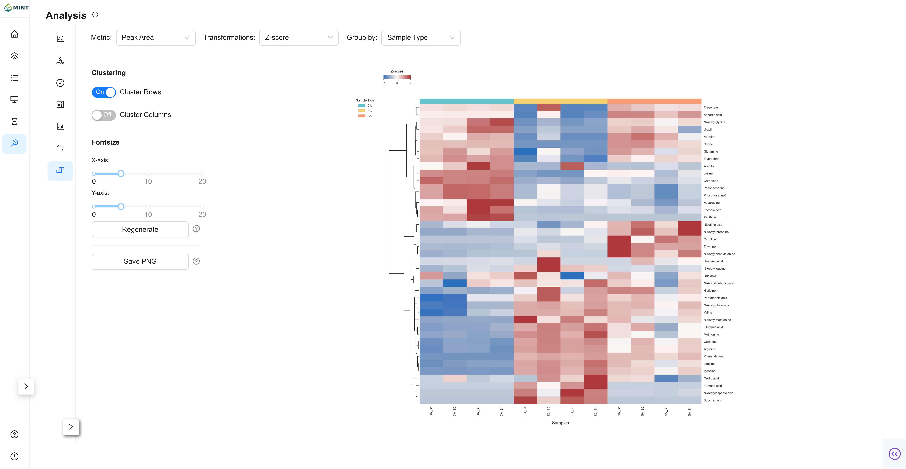

The `Analysis` tab is where you explore processed results interactively across multiple statistical and quality-control views.

> **Tip**: Click the help icon (small "i" symbol) next to the "Analysis" title to take a guided tour of this section.

### Global Controls {: #global-settings }

The top toolbar controls the data feeding all Analysis views.

*   **Metric**: `Peak Area`, `Peak Area (Top 3)`, `Peak Max`, `Peak Mean`, `Peak Median`, `Peak Area (EMG Fitted)`, and `Concentration` (when SCALiR output exists).
*   **Transformations**: Apply statistical transformations to the raw data:
    *   **None (raw)**: Use raw values.
    *   **Z-score**: Standardize features (mean=0, std=1).
    *   **Rocke-Durbin**: Variance stabilization.
    *   **Z-score + Rocke-Durbin**: Standardize, then stabilize variance.
*   **Group by**: Choose grouping by `sample_type` or metadata group columns (`group_1`...`group_5`).

??? info "Data scope and defaults"

    *   Analysis uses samples flagged `use_for_analysis = TRUE`.
    *   Default normalization is view-specific:
        *   `PCA`, `QC`, `Violin`, `Bar`, `Comparison`: `Rocke-Durbin`
        *   `t-SNE`, `Clustermap`: `Z-score`
    *   If results are missing, Analysis prompts you to run Processing first.
    *   Missing group labels are treated as an explicit `"(... unset)"` group and shown with neutral color.

### Analysis Views {: #analysis-views }

The left sidebar in the Analysis tab allows the user to switch between different views:

=== "PCA"

    #### PCA View {: #analysis-pca }

    PCA projects samples to principal components and highlights structure across groups.

    *   **Axis controls**: Choose X/Y among `PC1`...`PC5`.
    *   **Score plot**: Sample projection colored by the selected grouping field.
    *   **Variance panel**: Per-component and cumulative explained variance.
    *   **Loadings panel**: Top absolute loadings for the active component.

    

=== "t-SNE"

    #### t-SNE View {: #analysis-tsne }

    t-SNE provides nonlinear embedding for local neighborhood structure.

    *   **Axis controls**: Choose displayed dimensions (`t-SNE-1`...).
    *   **Perplexity slider**: Tune neighborhood size.
    *   **Generate button**: Recompute embedding with current settings.

    

    ??? info "t-SNE computation details"

        *   MINT computes up to 3 t-SNE dimensions.
        *   Perplexity is automatically constrained by sample count when needed.
        *   `Generate` is useful when you explicitly want a refreshed embedding after parameter changes.

=== "QC"

    #### QC View {: #analysis-qc }

    QC focuses on one target at a time.

    *   **Target selector**: Visible in the top bar only in QC mode.
    *   **RT panel**: Retention-time stability across samples.
    *   **Metric panel**: Selected metric across sample order.
    *   **Chromatogram panel**: Click points to inspect per-sample chromatograms.

    

    ??? info "QC target population and availability"

        *   QC target options are populated from targets that already have results.
        *   Chromatogram behavior and grouping colors follow the same global `Group by` setting.
        *   SCALiR concentration can be used as QC metric when concentration data exists.
        *   Large chromatogram views use [Progressive Loading / Shadow Plots](../concepts.md#shadow-plots) and [LTTB downsampling](../concepts.md#lttb-downsampling) to stay responsive.

=== "Violin"

    #### Violin View {: #analysis-violin }

    Violin shows per-target distributions by group and links directly to chromatograms.

    *   **Target selector**: Search and select a compound.
    *   **Distribution plot**: Violin + points grouped by the selected metadata field.
    *   **Stats in title**: t-test (2 groups) or ANOVA (>2 groups), when applicable.
    *   **Linked chromatogram**: Click a point to open sample chromatogram.

    

    ??? info "Smart defaults in Violin"

        *   Initial target defaults to a high-impact feature (PC1 loading heuristic).
        *   When needed, MINT auto-picks a representative sample with informative signal for chromatogram preview.

=== "Bar"

    #### Bar View {: #analysis-bar }

    Bar summarizes group means with sample-level context.

    *   **Mean +/- SEM**: Group bars with uncertainty.
    *   **Individual points**: Jittered sample overlay for spread inspection.
    *   **Stats in title**: t-test/ANOVA behavior mirrors Violin.
    *   **Linked chromatogram**: Click points to inspect sample traces.

    

    ??? info "Smart defaults in Bar"

        *   Initial target defaults to a high-impact feature (PC1 loading heuristic).
        *   When needed, MINT auto-picks a representative sample with informative signal for chromatogram preview.

=== "Comparison"

    #### Comparison View {: #analysis-comparison }

    Comparison tests all targets between two selected groups.

    *   **Group selection**: Pick `Sample 1` and `Sample 2` from current `Group by`.
    *   **Statistics controls**: Set p-value threshold and FDR method (`None`, `Benjamini-Hochberg`, `Bonferroni`).
    *   **Plot mode**: Toggle between scatter and volcano representations.
    *   **Chromatogram linkage**: Click a target point to inspect corresponding traces.

    

    ??? info "Feature selection workflow"

        *   `Add Selected Compound` stores clicked features into a selection list.
        *   `Clear Selection` resets the list.
        *   `Download` exports the selected feature list as CSV.
        *   If the chosen grouping field has fewer than two distinct values, comparison inputs are disabled.

=== "Clustermap"

    #### Clustermap View {: #analysis-clustermap }

    Clustermap renders a hierarchical heatmap of samples and targets.

    *   **Cluster controls**: Toggle row and column clustering.
    *   **Font-size controls**: Tune X/Y label readability.
    *   **Regenerate**: Recompute the clustermap with current options.
    *   **Save PNG**: Download current clustermap image.

    

    ??? info "Clustermap persistence"

        *   MINT also stores high-resolution clustermap images in workspace analysis folders for reuse/export.

### Plot Downloads {: #analysis-plot-downloads }

All Plotly-based views can be exported as high resolution figures with standardized export filenames (date + workspace + view) from the modebar camera/download control on the top right corner of every plot, which helps maintain reproducible figure naming across sessions.

??? info "Performance niceties"

    *   PCA/t-SNE/Violin include cache paths that reduce recomputation for group-only style changes.
    *   Spinners and staged updates are used across views to keep heavy updates responsive.
    *   Chromatogram-heavy views rely on [Progressive Loading / Shadow Plots](../concepts.md#shadow-plots), [LTTB downsampling](../concepts.md#lttb-downsampling), and [sparsification](../concepts.md#sparsification).
