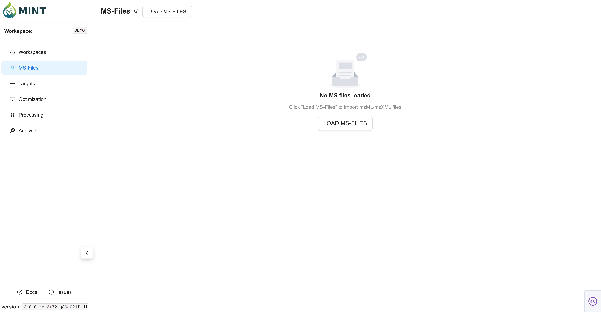
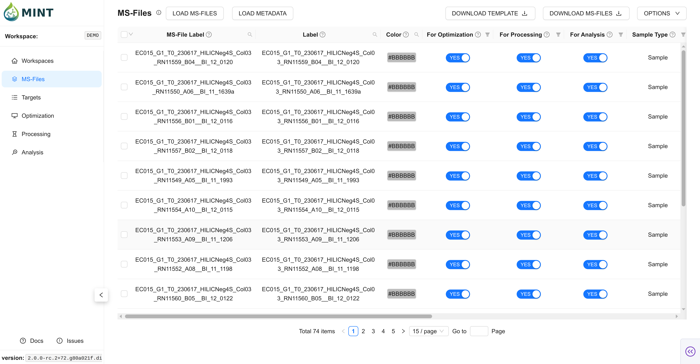

The `MS-Files` tab is the entry point for your analysis. Here you organize the raw mass spectrometry data that constitutes your workspace. MINT currently supports `.mzXML` and `.mzML` file formats for MS data. To import MS files, click the `LOAD MS-FILES` button. This opens a file browser where you can navigate your filesystem and select the MS files.

> **Tip**: Click the help icon (small "i" symbol) next to the "MS-Files" title to take a guided tour of this section.

### The MS-FILES Table {: #the-msfiles-table }

Once loaded, your MS files are displayed in an interactive table. For sample metadata, use `LOAD METADATA` and import a tabular file (CSV, TSV, TXT, XLS, XLSX). You can also download the template via `DOWNLOAD TEMPLATE` on the top right corner.

??? info "Metadata columns and descriptions"

    | Column Name             | Description                                                       |
    |-------------------------|-------------------------------------------------------------------|
    |`ms_file_label`          | Unique file name; must match the MS file label on disk            |
    |`label`                  | Friendly label to display in plots and reports                    |
    |`color`                  | Hex color for visualizations                                      |
    |`use_for_optimization`   | True to include in optimization steps (COMPUTE CHROMATOGRAMS)     |
    |`use_for_processing`     | True to include in processing (RUN MINT)                          |
    |`use_for_analysis`       | True to include in analysis outputs                               |
    |`sample_type`            | Sample category (e.g.; Sample; QC; Blank; Standard)               |
    |`group_1`                | User-defined grouping field 1 for analysis/grouping (free text)   |
    |`group_2`                | User-defined grouping field 2 for analysis/grouping (free text)   |
    |`group_3`                | User-defined grouping field 3 for analysis/grouping (free text)   |
    |`group_4`                | User-defined grouping field 4 for analysis/grouping (free text)   |
    |`group_5`                | User-defined grouping field 5 for analysis/grouping (free text)   |
    |`polarity`               | Polarity (Positive or Negative)                                   |
    |`ms_type`                | Acquisition type (ms1 or ms2)                                     |

*   **Checkbox**: Select multiple files for batch actions (delete/export).
*   **Color**: Used in plots and previews. You can edit manually or regenerate via `Options`.
*   **For Optimization / Processing / Analysis**: Toggle inclusion per workflow stage.
*   **Metadata Columns**: `Label`, `Sample Type`, and `Group` columns help organize downstream analysis.
*   **Acquisition Metadata**: MINT stores metadata such as polarity, MS level/type, file format, and acquisition datetime (when available from file headers) and user-defined metadata (e.g., Group 1, 2, etc.).

### Import Validation and Auto-Fill {: #import-validation-auto-fill }

MINT applies several automatic behaviors during MS file and metadata import.

??? info "Filename-based sample typing and color defaults"

    #### Automatic Sample-Type and Color Inference {: #automatic-sample-type-and-color-inference }

    When metadata is not provided yet, MINT initializes `sample_type` and `color` from MS-file labels:

    *   Blank-like names (for example `blank`, `blk`, `solvent`) -> `Blank`
    *   Standard-like names (for example `std`, `standard`, `cal`) -> `Standard`
    *   QC-like names (for example `qc`, `control`, `pool`) -> `QC`
    *   If no pattern matches -> `sample_type = Sample`
    *   Default fallback color for unmatched samples -> `#BBBBBB`

??? info "Metadata merge behavior"

    #### Metadata Merge Defaults {: #metadata-merge-defaults }

    During metadata import, MINT merges values into existing rows instead of blindly replacing everything.

    *   Required column: `ms_file_label`
    *   On ingestion, blank `use_for_optimization` and `use_for_processing` are treated as `TRUE`
    *   On DB update, non-null metadata values overwrite current values; null/blank values keep existing values
    *   Colors can be regenerated after merge to keep palettes consistent across sample groups

??? info "Workflow flag dependencies"

    #### Workflow Dependency Rules {: #workflow-dependency-rules }

    To keep stage flags consistent, MINT enforces:

    *   If `use_for_analysis` is set to `TRUE`, `use_for_processing` is auto-set to `TRUE`
    *   If `use_for_processing` is set to `FALSE`, `use_for_analysis` is auto-set to `FALSE`

??? info "Duplicate import behavior"

    #### Duplicate File Handling {: #duplicate-file-handling }

    When importing MS files, MINT uses `ms_file_label` (filename stem) as the identity key.

    *   Already imported labels are skipped (not duplicated)
    *   Import summary/notifications report skipped duplicates

### Options Menu {: #options-menu }

The `Options` dropdown (top right) provides quick actions:

*   **Generate colors**: Recompute colors for table entries.
*   **Delete selected files**: Remove checked rows from the workspace.
*   **Clear table**: Remove all MS files from the workspace.
