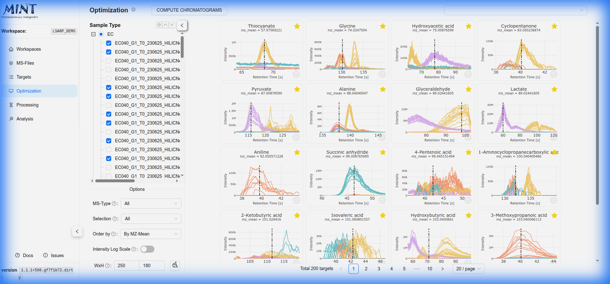

## Optimization {: #optimization }

The **Optimization** tab is designed to refine your peak integration windows (Retention Time) for specific targets. By optimizing the Retention Time (RT) ranges, you ensure that MINT extracts the maximum intensity for the correct peak, improving data quality.

> **Tip**: Click the help icon (small "i" symbol) next to the "Optimization" title to take a guided tour of this section.

### Peak Optimization Workflow {: #peak-optimization-workflow }

1.  **Define Scope**: Use the sidebar to select the specific `Samples` (by type, batch, etc.) and `Targets` you want to optimize.
2.  **Compute Chromatograms**: Click the `COMPUTE CHROMATOGRAMS` button. MINT will extract and display the Ion Chromatograms (EIC) for the selected targets across your samples.
3.  **Review Optimization Cards**: The results are displayed as "Optimization Cards". Each card represents a target and shows:
    *   **Chromatogram Plot**: The shape of the peak across samples.
    *   **Current RT Range**: The vertical dashed lines indicate the start and end of the integration window.

### Interactive Manual Optimization {: #interactive-manual-optimization }
Click on any `Optimization Card` or the `Graph` icon to open the detailed `Manual Optimization` modal. In this view, you can fine-tune the peak selection:

*   **Interactive Tuning**: Click and drag on the plot to manually set the new Retention Time (RT) start and end points for the target. The green shaded area represents the integration window.
*   **Intensity Scale**: Toggle between `Linear` and `Log` scales to better visualize low-intensity peaks.
*   **Legend Behavior**: Switch between `Group` (aggregate by sample type/metadata) or `Single` (individual file traces).
*   **Envelopes / Shadow Plots**: When `Group` legend mode or `Megatrace` is active, MINT displays an "Envelope" (Shadow Plot) representing the min, max, and mean intensities for each group. This allows for rapid inspection of large datasets without visual clutter.
*   **RT Alignment**: Enable automatic Retention Time alignment for the current target. 
    *   **Logic**: MINT calculates shifts based on the median apex position across all selected samples within the defined RT span.
    *   **Authoritative State**: Alignment shifts are stored per-target in the database and persisted across sessions.
    *   **Auto-Notes**: When enabled, alignment details (reference RT, shifts per sample type) are automatically appended to the target notes.
*   **Megatrace**: Toggle an aggregated "Megatrace" view. When RT alignment is active, Megatrace displays the aligned envelope, helping identify global peak shapes after correcting for shifts.
*   **Edit RT-span**: 
    *   **Edit**: Enable dragging/resizing the RT window.
    *   **Lock**: Prevent accidental changes to the RT range.
*   **Notes**: Add custom notes for specific targets. RT alignment data is preserved even if you edit notes manually.
*   **Save/Reset**: Save your adjusted RT bounds and alignment state to the target list or reset them to the original attributes.

### Bookmarking Targets {: #bookmarking-targets }
Each optimization card features a **Star icon** (Bookmark). 
*   **Usage**: Click the star to bookmark a target. 
*   **Purpose**: You can filter the MINT processing step to run *only* on bookmarked targets (see [Processing](processing.md)). This is useful for iteratively refining specific problematic compounds without reprocessing the entire dataset.

### Card Controls {: #card-controls }
At the bottom left of the Optimization tab, you can adjust the display size of the chromatogram cards using the **Width** and **Height** inputs. This allows you to fit more targets on the screen or enlarge them for detailed inspection.
