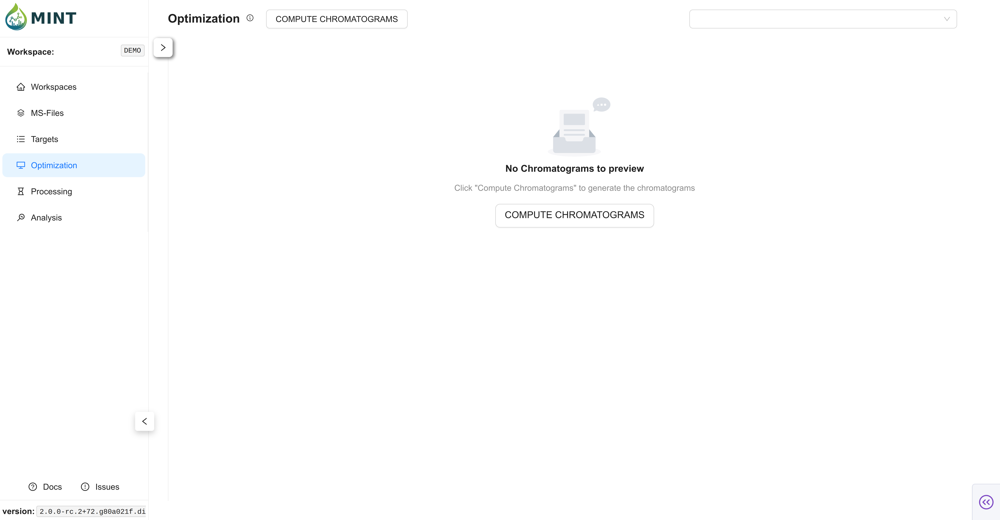
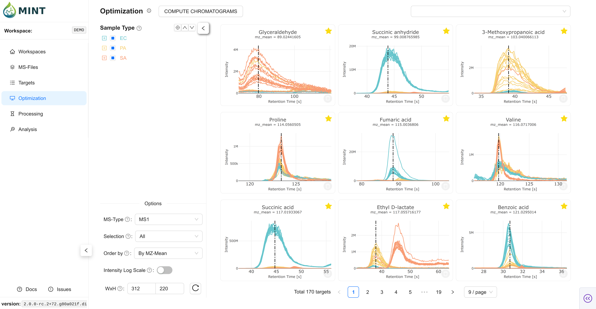
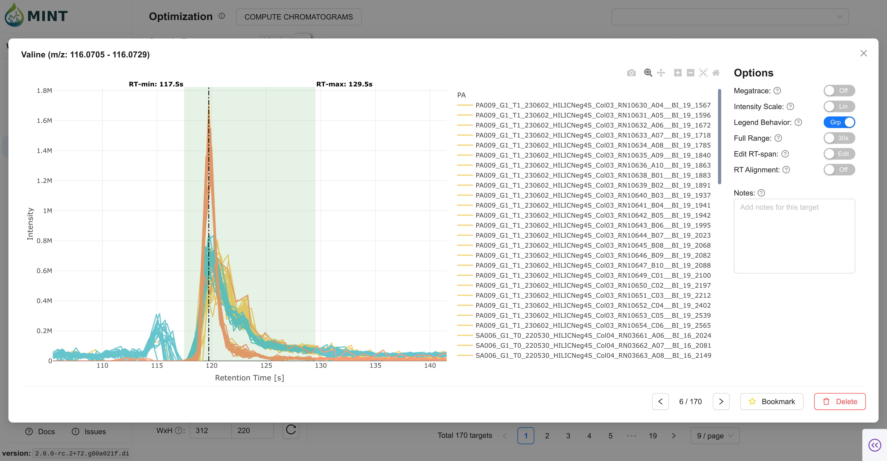

In the **Optimization** tab, the EIC are computed first based on the parameters defined in the Targets table. Next, target RT windows (`rt_min`, `rt_max`) can be refined so downstream extraction in Processing captures the correct peak region.

> **Tip**: Click the help icon (small "i" symbol) next to the "Optimization" title to take a guided tour of this section.

### Peak Optimization Workflow {: #peak-optimization-workflow }

1.  **Compute Chromatograms**: Click `COMPUTE CHROMATOGRAMS` to generate EIC traces.
2.  **Preview Cards**: Inspect chromatogram previews per target.
3.  **Open Manual View**: Click a card (or graph icon) to fine-tune RT ranges.
4.  **Persist Changes**: Auto-save events.

### 1. Compute Chromatograms {: #compute-chromatograms }

`COMPUTE CHROMATOGRAMS` opens a modal to configure recomputation and resources.

*   MINT validates prerequisites first (requires at least one optimization sample and one target).
*   If chromatograms already exist, MINT shows a warning and enables recompute toggles (`MS1`, `MS2`) automatically.
*   Default resources are auto-detected from your system (CPU/RAM), and batch size is auto-calculated from workload and resource settings.
*   If no targets are selected, MINT computes chromatograms for all targets.
*   After chromatograms are generated, MINT runs adaptive RT-span optimization for targets marked as auto-adjusted during import.

### 2. Preview Cards {: #chromatogram-preview-cards }

After computation, Optimization cards provide a quick glance at the data before manual edits.

*   **Card Plot**: per-target chromatogram view over the current RT span.
*   **Bookmark toggle**: star targets for later focused processing.
*   **Delete target**: remove target plus related chromatogram/results entries.
*   **Pagination and sizing**: browse with pagination and tune card width/height for your screen.

??? info "Preview filters"

    *   Filter by `ms_type` (`all`, `ms1`, `ms2`).
    *   Filter by bookmark state (`all`, `Bookmarked`, `Unmarked`).
    *   Order cards by peak label or m/z.
    *   Toggle log-y rendering for quick visual contrast checks.

### 3. Interactive Manual Optimization {: #interactive-manual-optimization }

Open a target card to launch the detailed modal and adjust RT spans directly on the plot. Move across targets without closing the modal. Changes are saved automatically.

*   **Edit RT-span**: drag/resize the RT window when unlocked.
*   **Lock range**: prevent accidental RT-window edits.
*   **Set RT marker**: click within the span to set/update target RT.
*   **Scale and grouping**: switch linear/log y-axis and group-click legend behavior.
*   **Notes**: edit target notes while inspecting traces.

??? info "Advanced modal controls"

    *   **Megatrace**: aggregated rendering mode for large trace sets.
    *   **Full range**: show full chromatogram instead of local window (can be slower).
    *   **RT Alignment**: align traces by apex within current RT span; alignment state is persisted per target.

### 4. Auto-save and persistence {: #autosave-and-persistence }

MINT includes persistence and consistency behaviors so optimization work is resilient:

*   On target navigation (`Prev`/`Next`), changed RT span and RT-alignment state are auto-saved.
*   On modal close, changed RT span / RT alignment are auto-saved.
*   Notes are persisted in navigation flows.
*   Use **Save** when you want immediate explicit commit feedback while staying on the same target.

### Card Controls {: #card-controls }

*   Bookmarking a target also marks it as selected (`peak_selection = TRUE`).
*   This keeps bookmarked subsets compatible with Processing filters such as `Bookmarked Targets Only`.
*   At the bottom-left of the Optimization page, adjust card **Width** and **Height** to trade off overview density vs detail visibility.
