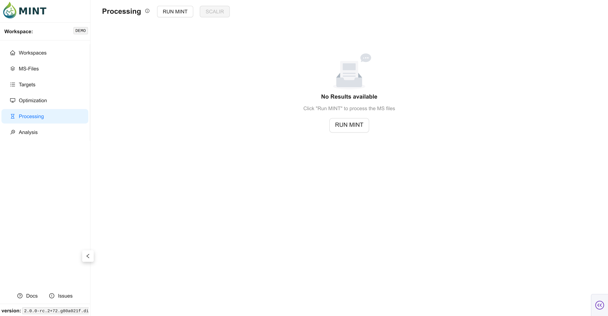
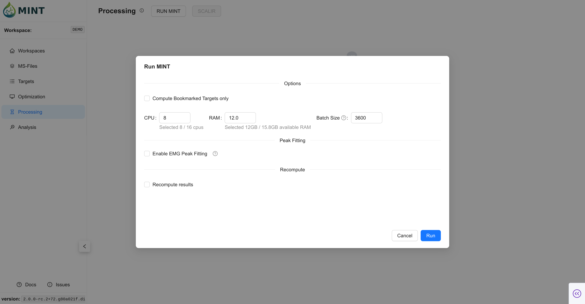
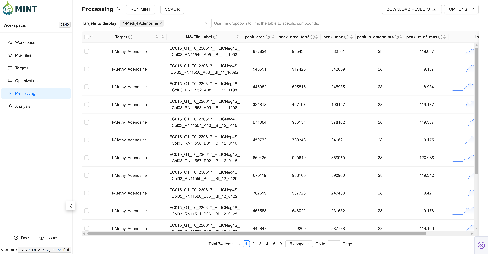
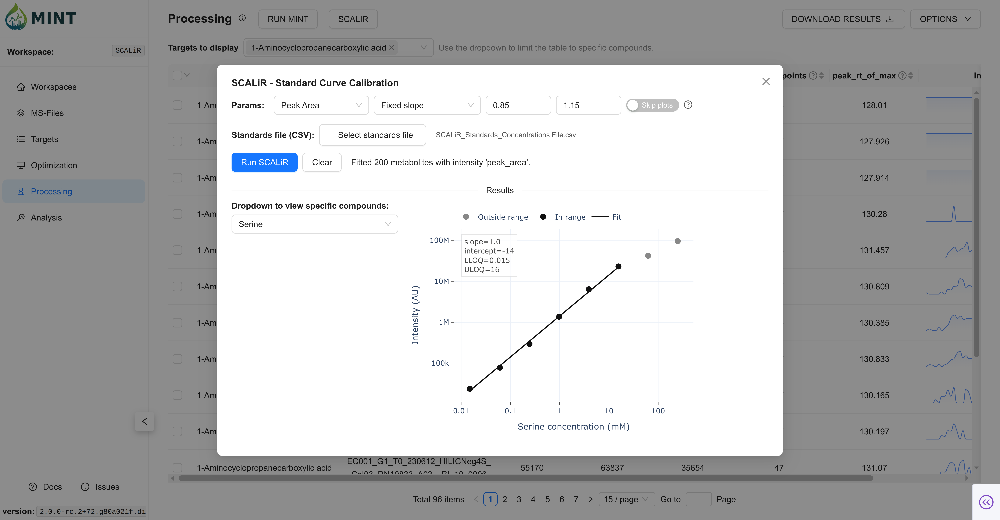

The `Processing` tab is where MINT performs production extraction for your workspace, generating the final `results` table used by downstream analysis and exports.

> **Tip**: Click the help icon (small "i" symbol) next to the "Processing" title to take a guided tour of this section.

### Processing Workflow {: #processing-workflow }

1.  **Set Scope And Resources**: Click `RUN MINT`. Choose bookmarked-only mode, recompute/fitting, and compute resources.
2.  **Run Extraction**: MINT computes chromatograms, then results, then optional EMG fitting.
3.  **Export Or Clean Up**: Download results or remove selected/all result rows.

### 1. Set Scope And Resources {: #run-mint-modal }

`RUN MINT` opens the execution modal for Processing.

*   **Bookmarked Targets Only**: Restrict execution to bookmarked targets.
*   **Recompute results**: Recalculate already existing result rows.
*   **Enable fitting (EMG)**: Run optional peak fitting after result extraction.
*   **Resources**: Configure CPU, RAM, and batch size.

??? info "Run-time behavior and defaults"

    *   CPU/RAM defaults are auto-detected from your machine.
    *   Batch size is auto-calculated from resource settings.
    *   Processing runs in staged phases with progress updates (`Chromatograms` -> `Results` -> optional `Peak Fitting`).

??? info "What 'Recompute results' affects"

    *   Recompute targets the results stage (and fitting stage, when enabled).
    *   During Processing runs, chromatogram generation uses the Processing pathway and is not the explicit MS1/MS2 recompute toggle used in Optimization.

### 2. Results Table {: #results-table }

After completion, `results` becomes the primary working dataset for review and downstream steps.

*   **Target filter dropdown**: Quickly narrow visible targets.
*   **Server-side filtering/sorting**: Efficient browsing for larger result sets.
*   **Optional fitted metrics**: Available when EMG fitting is enabled.

??? info "Core result columns"

    *   Core extraction metrics such as `peak_area`, `peak_max`, `peak_mean`, `peak_rt_of_max`.
    *   RT-alignment fields such as `rt_aligned`, `rt_shift`.
    *   Optional EMG fit fields such as `peak_area_fitted`, `peak_rt_fitted`, `fit_r_squared`, `fit_success`.

??? info "Processing filter semantics"

    *   Results shown in this page are constrained to samples marked `use_for_processing = TRUE`.
    *   The target dropdown controls which compounds are rendered in the table.

### 3. Exporting Data {: #exporting-data }

Use `DOWNLOAD RESULTS` to export either full (tidy/long) outputs or dense matrices.

*   **All Results (tidy/long)**: Column-selectable export of raw results rows.
*   **Dense Matrix (wide/pivot)**: Pivot by selected row/column/value fields.

??? info "All Results export behavior"

    *   MINT validates selected columns against supported export fields.
    *   Export prefers a workspace backup file when available for faster delivery.
    *   For large files, MINT switches to direct Flask file download to avoid browser/base64 bottlenecks.

??? info "Dense matrix validation"

    *   Requires valid row/column/value selections.
    *   Prevents invalid combinations (for example identical row and column keys).

### Managing Results {: #managing-results }

Use the `Options` menu to clean up result subsets or reset the table.

*   **Delete selected results**: Removes selected `(peak_label, ms_file_label)` pairs.
*   **Clear table**: Removes all rows from `results`.

??? info "Deletion semantics"

    *   `Delete selected` removes only selected target/sample pairs.
    *   `Clear table` removes the complete `results` table content.
    *   Deletions invalidate the results backup snapshot so exports reflect current DB state.

### Results Backup Snapshot {: #results-backup-snapshot }

After a successful Processing run, MINT writes a workspace-local CSV backup snapshot:

*   **Path**: `<workspace>/results/results_backup.csv`
*   **Purpose**: Faster exports and resilience/recovery.
*   **Update behavior**: Regenerated after runs; invalidated when results are deleted so the next export rebuilds cleanly.

### SCALiR (Optional) {: #scalir-processing }

SCALiR is an optional absolute-quantification workflow layered on top of Processing results.

*   Provide a standards file.
*   Fit calibration curves.
*   Export concentrations and (optionally) calibration plots.
