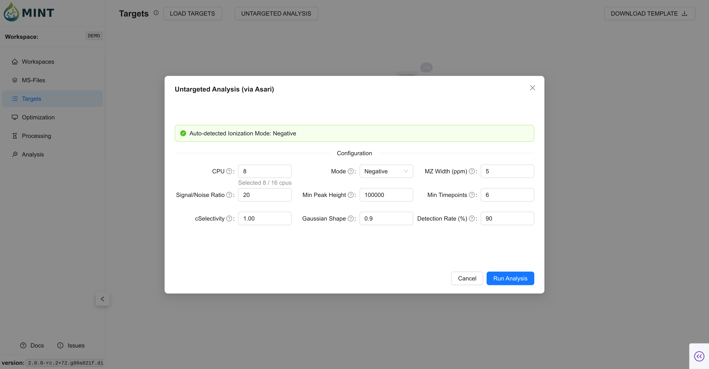

Target lists are collections of peak definitions used to extract MS intensities for specific metabolites. The `Targets` tab allows you to manage, review, and refine these definitions before processing. To import a target list, click the `Load Targets` button. This opens a file browser where you can navigate your filesystem and select a CSV file containing your peak definitions.

> **Tip**: Click the help icon (small "i" symbol) next to the "Targets" title to take a guided tour of this section.

### The Targets Table {: #the-targets-table }

The target list can be provided as a CSV file with the following columns. A MINT-compatible template can be downloaded in the Targets tab (`DOWNLOAD TEMPLATE` button on the top right corner).

??? info "Targets table columns and descriptions"

    | Column Name             | Description                                                          |
    |-------------------------|----------------------------------------------------------------------|
    |`peak_label`             | Unique metabolite/feature name                                       |
    |`peak_selection`         | True if selected for analysis                                        |
    |`bookmark`               | True if bookmarked                                                   |
    |`mz_mean`                | Mean m/z (centroid)                                                  |
    |`mz_width`               | m/z window or tolerance                                              |
    |`mz`                     | Precursor m/z (MS2)                                                  |
    |`rt`                     | Retention time (default: in seconds)                                 |
    |`rt_min`                 | Lower RT bound (default: in seconds)                                 |
    |`rt_max`                 | Upper RT bound (default: in seconds)                                 |
    |`rt_unit`                | RT unit (e.g. s or min; default: in seconds)                         |
    |`intensity_threshold`    | Intensity cutoff (anything lower than this value is considered zero) |
    |`polarity`               | Polarity (Positive or Negative)                                      |
    |`filterLine`             | Filter ID for MS2 scans                                              |
    |`ms_type`                | ms1 or ms2                                                           |
    |`category`               | Category                                                             |
    |`formula`                | Chemical formula (used to derive m/z when mz_mean is missing)        |
    |`maven_id`               | Maven ID or Group ID (optional identifier)                           |
    |`adduct_name`            | Adduct name (e.g. [M+H]+); optional and can be auto-populated        |
    |`score`                  | Optional legacy score field                                          |
    |`notes`                  | Free-form notes                                                      |
    |`source`                 | Data source or file                                                  |

Once loaded, your targets are displayed in an interactive table with the following key columns:

*   **Peak Label**: The unique identifier for the metabolite or feature.
*   **Selection & Bookmark**: Selection is meant for selection of targets for processing. Bookmarking is meant for bookmarking specific targets for later use.
*   **MZ Data**: `mz_mean` and `mz_width` define the mass-to-charge ratio window for extraction.
*   **Retention Time**: `rt_min` and `rt_max` define the expected time window for the peak. The `rt` column typically represents the expected retention time of the peak.
*   **Filtering**: Each column header includes a filter icon, allowing you to search for specific compounds or filter by values.

### Selection And Bookmark Semantics {: #selection-and-bookmark-semantics }

MINT uses `peak_selection` and `bookmark` with a few workflow rules that affect Optimization and Processing:

*   **Selection drives default target scope**: selected targets are included first.
*   **If no targets are selected**, MINT falls back to treating this as **all targets selected** (instead of processing zero targets).
*   **Bookmark implies selection**: when a target is bookmarked, MINT also marks it selected so bookmarked subsets remain processable.
*   **Bookmarked-only mode (Processing)**: enabling `Bookmarked Targets Only` intersects the processing scope with bookmarked targets.

### Importing from External Software {: #importing-from-external-software }

MINT supports importing target lists directly from other software formats, such as **EL-MAVEN (peak lists and group exports)**.

Key features of this import functionality include:

*   **Format Support**: Reads CSV, TSV, Excel, and JSON (EL-MAVEN group exports) files.
*   **Automatic Column Mapping**: MINT automatically detects and renames columns from common formats to the MINT standard.
    *   `compound`, `compoundName`, `name` -> `peak_label`
    *   `meanMz`, `medMz`, `parent`, `row m/z` -> `mz_mean`
    *   `meanRt`, `medRt`, `expectedRt`, `row retention time` -> `rt`
    *   `formula`, `parentformula` -> `formula`
*   **Unit Conversion**: Retention times in EL-MAVEN files (typically in minutes) are automatically converted to seconds.
*   **Priority Handling**: If a file contains multiple potential columns for the same value (e.g., both `meanMz` and `medMz`), MINT automatically selects the most appropriate one based on a predefined priority list.

### Untargeted analysis (via Asari) {: #auto-generate-targets }

If you don't have a pre-defined target list, MINT can automatically detect features in your processed files using [Asari](https://github.com/shuzhao-li/asari).

1.  Click the `Untargeted analysis` button to open the configuration modal.
2.  Adjust the parameters to suit your data (ionization mode, mass tolerance, signal-to-noise ratio, etc.).
3.  Click `Run Analysis`. MINT will process the files in the background and populate the table with detected features.

**Key Parameters:**

- **CPU**: Number of cores to use for parallel processing.
- **Mode**: Ionization mode (`Positive` or `Negative`).
- **MZ Width (ppm)**: Mass tolerance for grouping peaks.
- **Signal/Noise Ratio**: Minimum signal-to-noise ratio for peak detection.
- **Min Peak Height**: Minimum intensity required for a peak to be considered.
- **Min Timepoints**: Minimum number of scans required to define a peak shape.

### Import Validation And Auto-Fill {: #import-validation-auto-fill }

MINT only strictly requires `peak_label` plus enough RT information to define a window. For each target row, MINT accepts a valuid RT input patterns and auto-fills missing values. Below, we explain in detail some of the rules MINT uses to fill missing element in the targets table. Click the banner to expand.

??? info "RT Auto-Derivation and Validation"

    #### RT Auto-Derivation and Validation {: #rt-derivation-and-validation }

    *   `rt_min` + `rt_max` only: MINT derives `rt` as the midpoint.
    *   `rt` only: MINT initializes `rt_min` and `rt_max` using a temporary symmetric bootstrap window (`rt ± 5.0 s`) so targets can be processed immediately. The `±5.0 s` rule is an initial import fallback, not the final recommended span. After chromatograms are computed, refine RT bounds in the _Optimization_ tab using the observed peak shape and apex
    *   `rt` + `rt_min`: MINT derives `rt_max` symmetrically around `rt`.
    *   `rt` + `rt_max`: MINT derives `rt_min` symmetrically around `rt`.
    *   All three (`rt`, `rt_min`, `rt_max`): MINT keeps them, then validates consistency.

    Invalid RT inputs:

    *   Only `rt_min` (without `rt` or `rt_max`)
    *   Only `rt_max` (without `rt` or `rt_min`)
    *   Missing all RT fields (`rt`, `rt_min`, and `rt_max`)

    Additional RT validation done during import:

    *   `rt_min` must be less than `rt_max`
    *   `rt_min`/`rt_max`/`rt` cannot be negative
    *   If `rt` is outside `[rt_min, rt_max]`, MINT resets `rt` to the span midpoint
    *   `rt_unit` values in minutes are converted to seconds, and stored as seconds

??? info "Defaults And Overrides"

    ### Defaults And Overrides {: #targets-defaults-and-overrides }

    During import, MINT applies a few defaults and override rules so target rows are immediately usable:

    *   **`mz_width` default**: If `mz_width` is missing, MINT sets it to `10.0` (ppm).
    *   **`peak_selection` default**: If missing/blank, targets default to `True` (selected).
    *   **`bookmark` default**: If missing/blank, targets default to `False`.
    *   **`ms_type` source of truth**: MINT derives `ms_type` from `filterLine`:
        *   `filterLine` present -> `ms2`
        *   `filterLine` absent -> `ms1`
    *   **`ms_type` conflict handling**: If your file provides `ms_type` that contradicts `filterLine`, MINT keeps the derived value and logs a warning.
    *   **`rt_unit` normalization**: Units in minutes are converted to seconds, and stored with `rt_unit = s`.

??? info "Duplicate Label Handling"

    ### Duplicate Label Handling {: #duplicate-label-handling }

    When imported targets contain repeated `peak_label` values, MINT resolves them automatically:

    *   **Duplicate labels are renamed** to `peak_label@RT` (for example, `Succinate@315.20`) when RT is available.
    *   **Exact duplicate rows after renaming** (same final label) are collapsed to one entry.
    *   A summary of duplicate-label handling is reported in processing notifications/logs.

??? info "Smart Enrichment After Import"

    ### Smart Enrichment After Import {: #smart-enrichment-after-import }

    After parsing and validation, MINT applies additional enrichment to improve incomplete target tables:

    *   **Polarity inference from loaded MS files**: If loaded samples have one consistent polarity, missing target polarities are auto-filled from that value.
    *   **Polarity mismatch warning**: If a target explicitly specifies a different polarity than the loaded MS files, MINT keeps the row but emits a warning.
    *   **Adduct auto-fill**: If `adduct_name` is missing, MINT derives defaults from polarity (`[M+H]+` for positive, `[M-H]-` for negative).
    *   **Formula-based `mz_mean` fill**: If `mz_mean` is missing and `formula` is present, MINT attempts to calculate `mz_mean` from formula + polarity.
    *   **MS1 precursor cleanup**: For `ms1` targets, `mz` (precursor field) is cleared to avoid redundant/confusing values.

??? info "Backup Snapshot"

    ### Backup Snapshot {: #targets-backup-snapshot }

    Whenever targets are imported (file upload) or generated via Asari, MINT writes a workspace-local backup snapshot:

    *   **Path**: `<workspace>/data/targets_backup.csv`
    *   **Purpose**: Fast recovery/export of the current target table and safer downstream workflows.
    *   **Update behavior**: The file is refreshed after each successful target load/generation.

### Options Menu {: #options-menu }

The **Options** dropdown (top right) provides bulk actions for list management:

*   **Delete selected**: Remove currently checked rows from the workspace.
*   **Clear table**: Remove all targets.
