# Quickstart Guide for ms-mint-app
Welcome to the ms-mint-app quickstart guide! This guide helps you get up and running with the application so you can start analyzing mass spectrometry data efficiently. Follow the steps below to install the app, create a workspace, and begin processing your data.

## 1. Open `ms-mint-app`

Download an executable compatible with your OS and open MINT (see other installation options [here](install.md)).

<!-- To install MINT, run:

```
pip install ms-mint-app
```

or follow the instructions [here](install.md).

Then start the application with

```
Mint
```

or, if you have a prefered directory for data you can specify it with `--data-dir` e.g.:

```
Mint --data-dir /data
```

The application will take a while until it starts up. In the mean time the browser window will show

> This site can’t be reached

Just wait a bit until the terminal shows `INFO:waitress:Serving on http://127.0.0.1:9999` and refresh the page.
The application is now served on port `9999` of your local machine. -->

## 2. Create a workspace
If you have never started the application before, you will not have any workspaces yet. A workspace provides easy access to all data files and results for a given project.

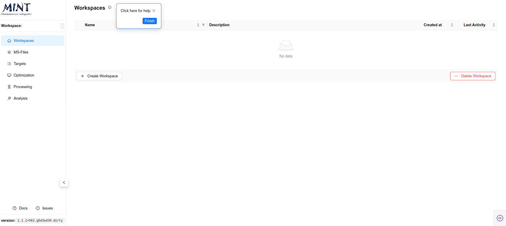

In the `Workspaces` tab, click the `+ Create Workspace` button. A dialog opens asking for the name of the workspace and an optional description. Type `DEMO` into the text field, add a brief description like `This is a DEMO`, and click `Create`.

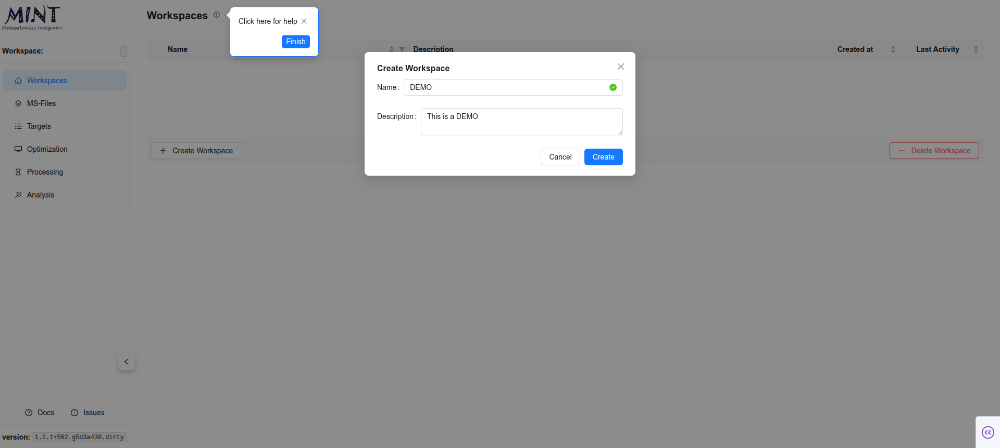

You can see which workspace is active by looking at the blue toggle to the left of the workspace name. Click the `+` sign to view the workspace folder location and stats like how many samples were analyzed and how many compounds were included in the analysis.

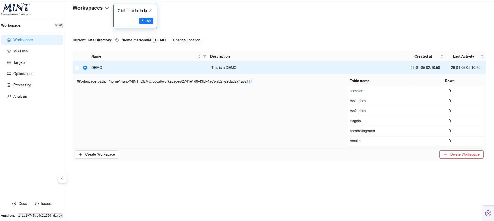

Now you have created your first workspace, but it is empty. You will need some input files to populate it.

## 3. Download the demo files

Some demo files are available for download on the `ms-mint` Google Drive. Download the files from [Google Drive](https://drive.google.com/drive/folders/1U4xMy5lfETk93sSVXPI79cCWyIMcAjeZ?usp=drive_link) and extract the archive.

You will find two `csv` files and 8 `mzXML` files.

```
.
├── README.md
├── metadata
│   └── metadata.csv
├── ms-files
│   ├── CA_B1.mzXML
│   ├── CA_B2.mzXML
│   ├── CA_B3.mzXML
│   ├── CA_B4.mzXML
│   ├── EC_B1.mzXML
│   ├── EC_B2.mzXML
│   ├── EC_B3.mzXML
│   ├── EC_B4.mzXML
└── targets
    └── targets.csv

4 directories, 15 files
```

- A folder with 8 mass-spectrometry (MS) files from microbial samples. We have four files for each  _Escherichia coli_ (EC), and _Candida albicans_ (CA).
Each file belongs to one of four batches (B1-B4).
- `metadata.csv` contains this information in tabular format. Submitting metadata is optional, but highly recommended and makes downstream analysis smoother.
- `targets.csv` contains the extraction lists. The identification of the metabolites has been done before, so we know where the metabolites appear in the MS data.

## 4. Upload LCMS files

Switch to the `MS-Files` tab and upload the 12 MS files. Click `LOAD MS-FILES` on the top left, navigate to the folder where the files are located, select either the files individually or the folder, and click `Process Files`.

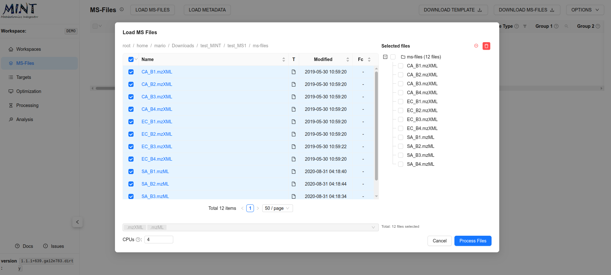

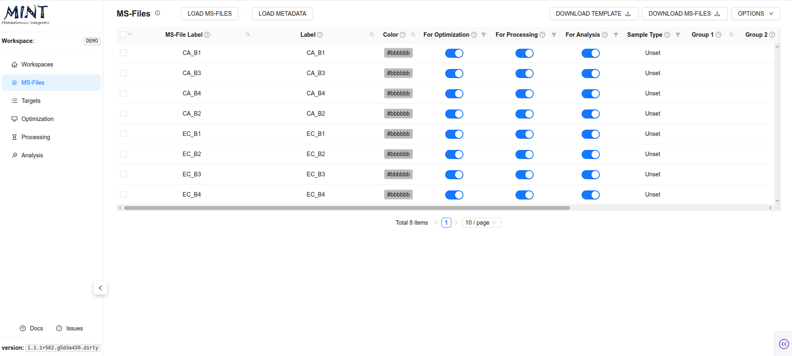

At this point you can proceed with the rest of the steps without providing any metadata; however, we strongly recommend using metadata to streamline downstream analyses.

## 5. Add metadata (Optional, but highly recommended)

In the same way as before, click `LOAD METADATA` on the top left, navigate to the folder where the metadata file is located, select the file, and click `Process Files`. If colors are not provided, automatic ones are assigned according to sample type.

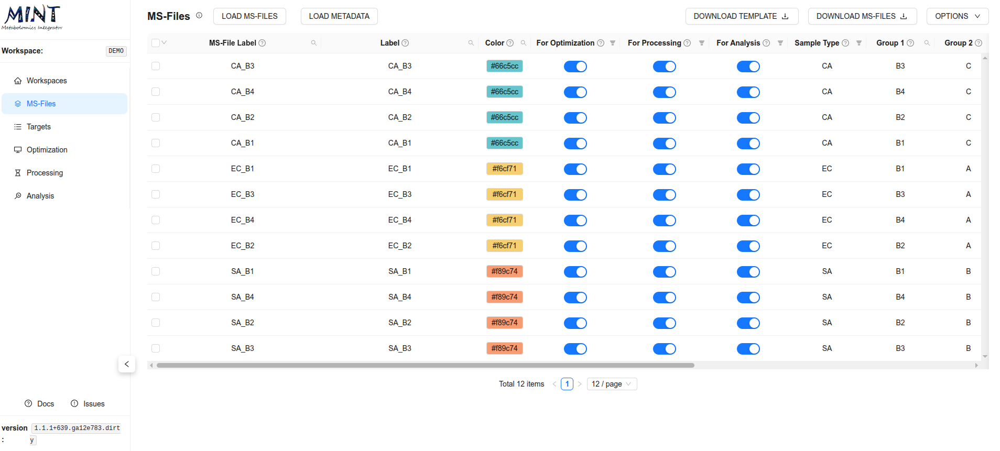

This file contains important information about your samples.

| Column Name             | Description                                                       |
|-------------------------|-------------------------------------------------------------------|
|`ms_file_label`          | Unique file name; must match the MS file on disk                  |
|`label`                  | Friendly label to display in plots and reports                    |
|`color`                  | Hex color for visualizations (auto-generated if blank)            |
|`use_for_optimization`   | True to include in optimization steps (COMPUTE CHROMATOGRAMS)     |
|`use_for_processing`     | True to include in processing (RUN MINT)                          |
|`use_for_analysis`       | True to include in analysis outputs                               |
|`sample_type`            | Sample category (e.g.; Sample; QC; Blank; Standard)               |
|`group_1`                | User-defined grouping field 1 for analysis/grouping (free text)   |
|`group_2`                | User-defined grouping field 2 for analysis/grouping (free text)   |
|`group_3`                | User-defined grouping field 3 for analysis/grouping (free text)   |
|`group_4`                | User-defined grouping field 4 for analysis/grouping (free text)   |
|`group_5`                | User-defined grouping field 5 for analysis/grouping (free text)   |
|`polarity`               | Polarity (Positive or Negative)                                   |
|`ms_type`                | Acquisition type (ms1 or ms2)                                     |


## 6. Add targets (metabolites)
Switch to the `Targets` tab and upload `MINT-targets.csv`.

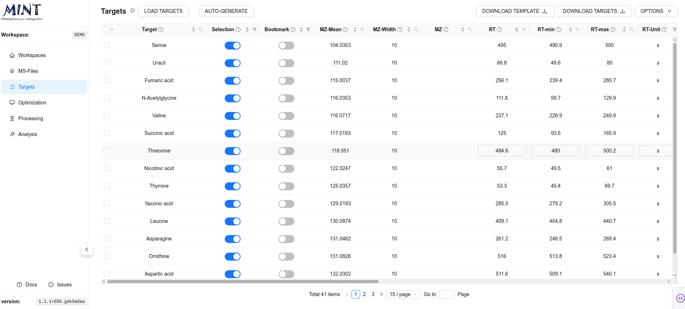

This is the data extraction protocol. This determines what data is extracted from the files. The same protocol is applied to all files. No fitting or peak optimization is done.

This file contains important information about the targets.

| Column Name             | Description                                                          |
|-------------------------|----------------------------------------------------------------------|
|`peak_label`             | Unique metabolite/feature name                                       |
|`peak_selection`         | True if selected for analysis                                        |
|`bookmark`               | True if bookmarked                                                   |
|`mz_mean`                | Mean m/z (centroid)                                                  |
|`mz_width`               | m/z window or tolerance                                              |
|`mz`                     | Precursor m/z (MS2)                                                  |
|`rt`                     | Retention time (default: in seconds)                                 |
|`rt_min`                 | Lower RT bound (default: in seconds)                                 |
|`rt_max`                 | Upper RT bound (default: in seconds)                                 |
|`rt_unit`                | RT unit (e.g. s or min; default: in seconds)                         |
|`intensity_threshold`    | Intensity cutoff (anything lower than this value is considered zero) |
|`polarity`               | Polarity (Positive or Negative)                                      |
|`filterLine`             | Filter ID for MS2 scans                                              |
|`ms_type`                | ms1 or ms2                                                           |
|`category`               | Category                                                             |
|`score`                  | Score                                                                |
|`notes`                  | Free-form notes                                                      |
|`source`                 | Data source or file                                                  |


## 7. Optimize retention times (Optional, but highly recommended)
Switch to the `Optimization` tab. Traditionally, and especially for large datasets, you select a representative set of samples including standards (with known concentrations of the target metabolites) to perform the optimization. However in MINT, you can perform the optimization with all the samples in most cases (see the files selected for optimization in the tree on the left side).

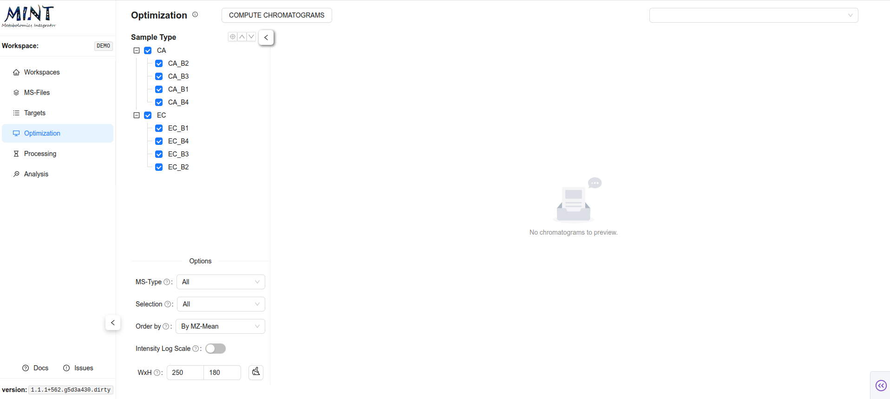

The peak optimization takes longer the more files are used for it and the more targets are defined. Click on `COMPUTE CHROMATOGRAMS`. Here you can select how much resources you want to allocate to process the files, including CPU, RAM and batch size. In small datasets the defult values should suffice, as the number of files used for optimization grow, tweaking these parameters will guarantee better performance. Click `Generate` to compute the chromatograms.

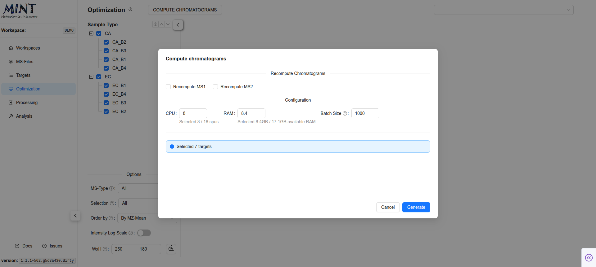
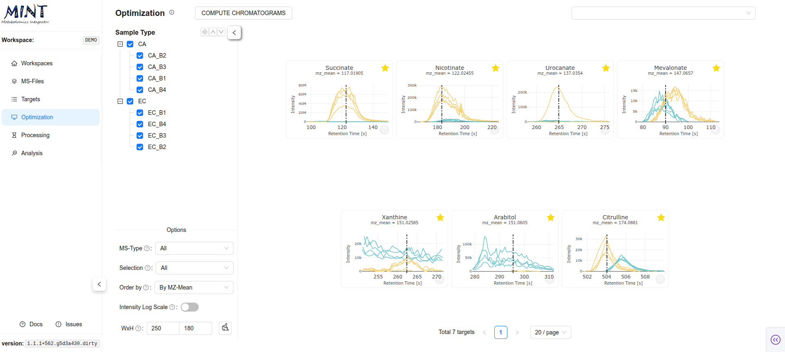

This shows the shapes of the data in the selected regions as an overview. This is a great way to validate that your target parameters are correct.
However, you have to make sure that the metabolite you are looking for is present in the files. That is why you should always add some standard samples (samples with the metabolite of interest at different concentrations). The colors in the plots correspond to the sample type colors in the metadata table.

You can click on a card to use the interactive tool below and manually optimize the region of interest (ROI) or retention time span for each target. Move the borders of the box to select the peak, then click `Save`. The green area shows the currently selected retention time (RT) range. If the target is not present in any of the files, you can remove it from the target list by clicking `Delete target`.

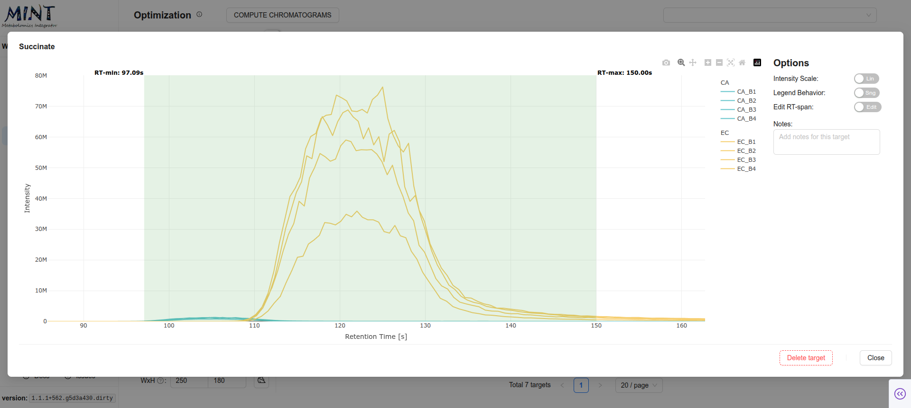

Once the optimization is done, you can proceed to `Processing`.

## 8. Process the data

Switch to `Processing` and start data extraction with `RUN MINT`. As in Optimization, you can choose how many resources to allocate to process the files, including CPU, RAM, and batch size. In small datasets the default values should suffice; as the number of files used for optimization grows, tweaking these parameters will improve performance. Click `Run` to compute the results.

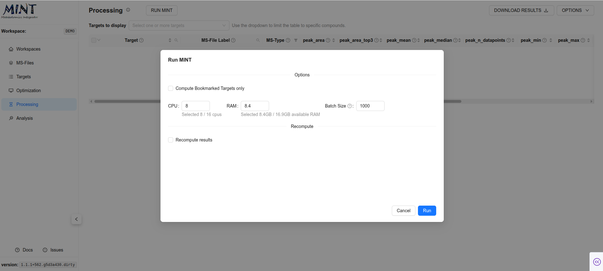
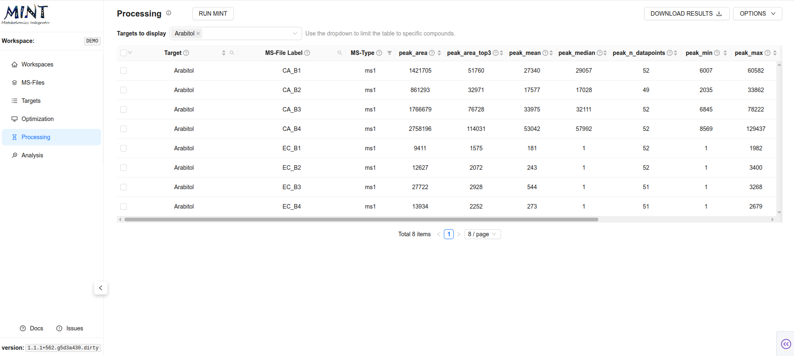


Now, you can download the results in long format or dense `peak_max` values by clicking `DOWNLOAD RESULTS`. The tidy format contains all results, while the dense format contains a selected metric (`peak_max` by default) as a matrix of values.

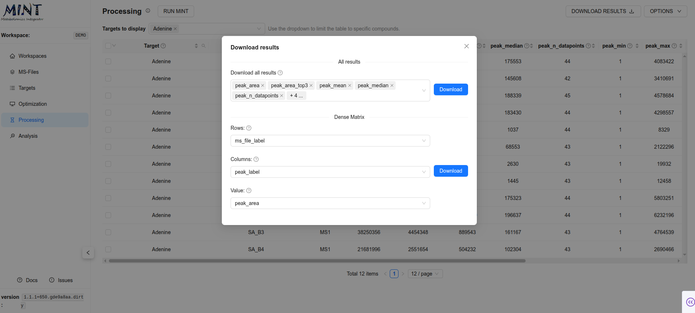

## 9. Analyze the results

Once the results are generated, there are several analyses you can perform. In the analysis section you can see four tabs, each corresponding to a different analysis.

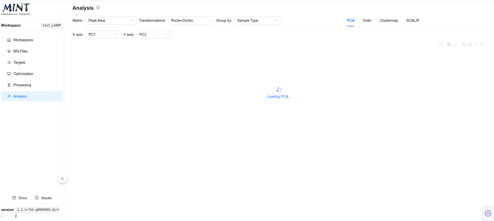


=== "Clustermap"
    Clustered heatmap showing relationships between samples and targets. In this tab you can select from different metrics (_i.e._, peak_area, peak_top3, etc.), transformations (_i.e._, z-score, log2, etc.) and groupings (_i.e._, Sample type, Group 1, 2, etc.)

    

=== "PCA"
    Principal component analysis plot for sample-level patterns. Includes an score plot (PC1 to PC5) on the left side, cummulative variance (top right), and absolute loading values for a selected PC (bottom rigth).

    


=== "Violin"
    Distribution plots by group (_i.e._, Sample type, Group 1, 2, etc.) to compare target values. Includes a hypothesis test result (t-test for two samples, ANOVA for more than 2 samples) on the top rigth corner.

    

=== "Scalir"
    Summary view for calculating concentrations.

    
